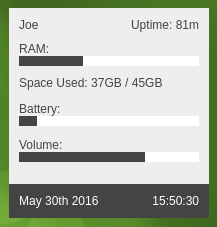
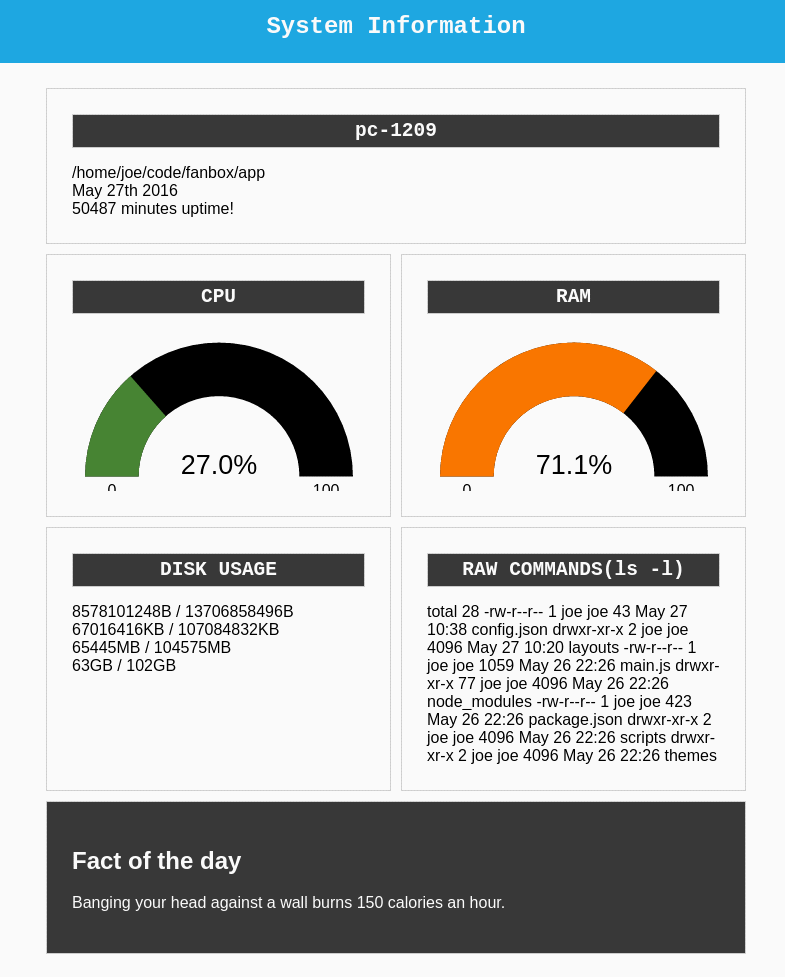

# Fanbox

[](https://www.bithound.io/github/joereynolds/fanbox)

## Installation

### Debian distros

Download and install the `.deb` package on the [releases](https://github.com/joereynolds/fanbox/releases) page.

### Everyone else
```
git clone https://github.com/joereynolds/fanbox
npm install
npm start
```

## Examples



## Fanbox

Fanbox is a desktop dashboard (like conky) built on HTML, CSS, and Javascript.
Fanbox is created and styled with HTML and CSS so anyone comfortable with those two things should feel right at home with fanbox. 

There are no made-up tags or any scripts to adjust, just HTML.

## Getting started

See the [getting started](docs/getting-started.md) guide for a complete run through of creating a theme.

## Examples

Here are a few examples of what Fanbox comes with out of the box

### HTML classes to display system information
```
<main>
  <!-- Shows a gauge bar of RAM usage-->
  <div class="ram">
    <div class="value" data-format="chart-gauge"></div>
  </div>

  <!-- RAM usage in a horizontal bullet chart -->
  <div class="ram">
    <div class="value" data-format="chart-bar"></div>
  </div>

  <!-- Shows a gauge bar of CPU usage -->
  <div class="cpu">
    <div class="value" data-format="chart-gauge"></div>
  </div>

  <!-- Shows system uptime in minutes (can also do seconds and hours) -->
  <div class="uptime">
    <div class="value" data-format="minutes"></div>
  </div>

  <!-- Execute a shell command to show the pwd -->
  <div class="raw-command">
    <span class="value" data-command="pwd"></span>
  </div>
</main>
```

### Execute raw shell commands

Fanbox doesn't come with everything under the sun, if it's missing something you need, you can add it in yourself with some shell-fu!

Just give a tag the ```raw-command``` class and inject your command into ```data-command``` like so

```
<div class="raw-command">
  <span class="value" data-command="ls -l"></span>
</div>
```

This be can be further expanded to provide actual useful information like battery level and volume level.

```
<!-- Shows battery level in percentage -->
<span class="raw-command">
  <span class="value" data-command="upower -i /org/freedesktop/UPower/devices/battery_BAT0 | grep percentage | awk '{print $2}'"></span>
</span>
```

```
<!-- Shows volume level in percentage -->
<span class="raw-command"
  <span class="value" data-command='exec pactl list sinks | grep "Volume: 0" | cut -d " " -f4 | sed -n 2p'></span>
</span>
```
### Contributing.

If you'd like to contribute, first off, thank you!
You can read more with our [contribution guide](docs/contributing.md)

### Reference

For a complete reference of every HTML class available and the various ```data-format```s please see the [reference](docs/reference.md) guide
